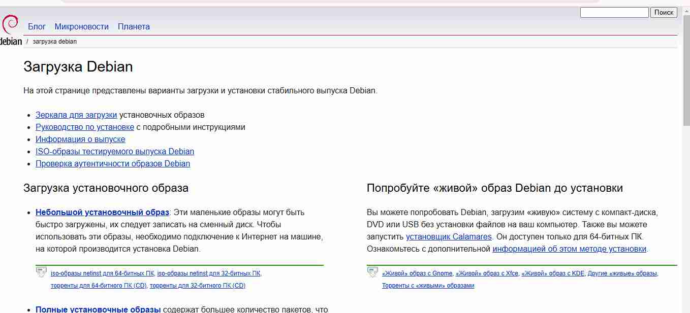
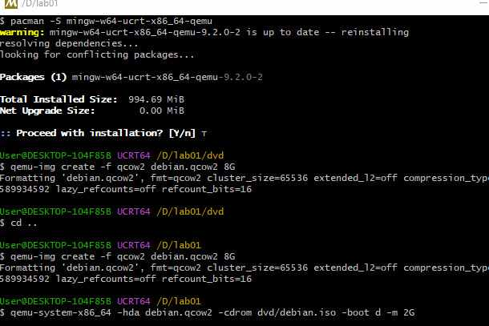
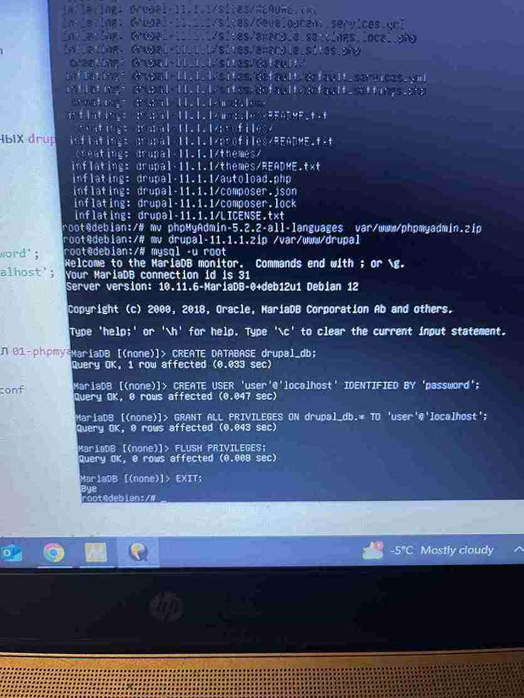
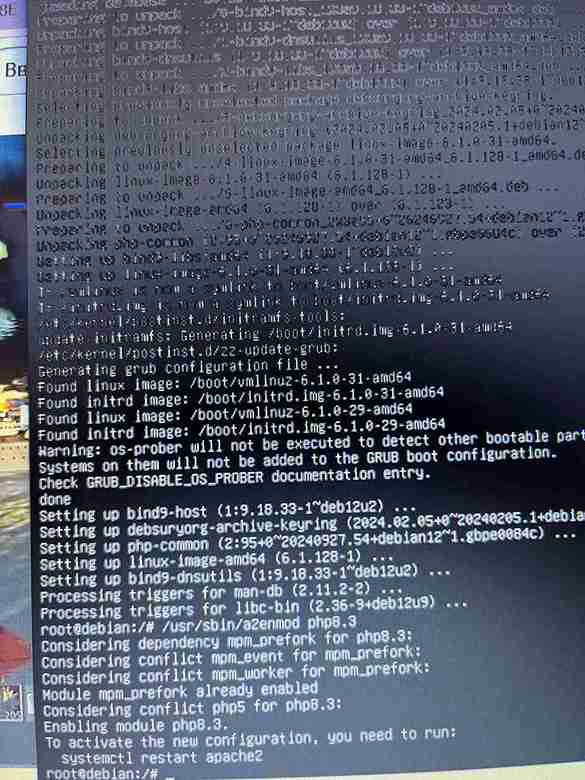
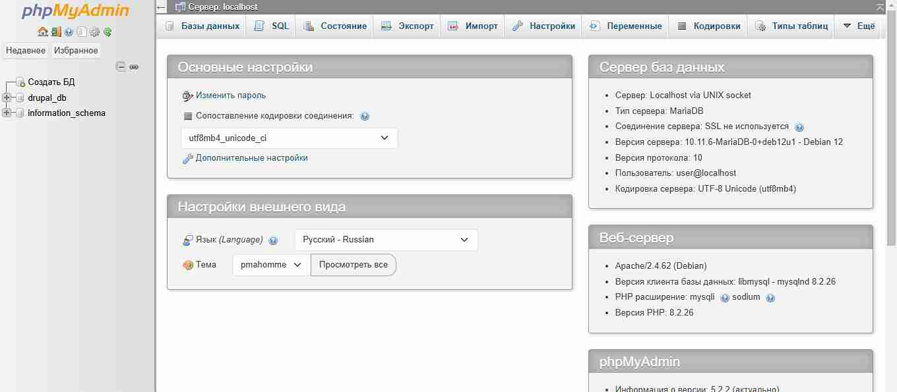
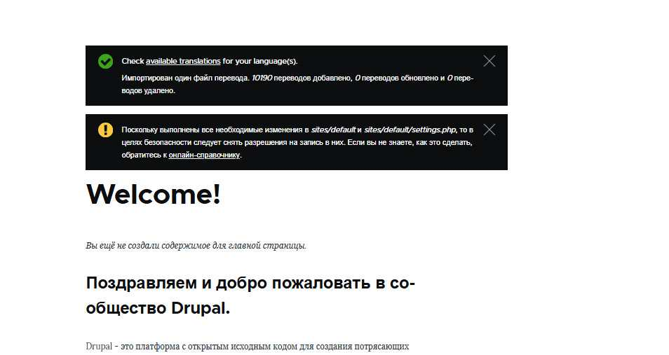

# Лабораторная работа №1. Виртуальный сервер

## Студентка: **Годорожа Оксана**, группа I2302

Дата выполнения: **10.02.2025**

## Описание задачи

В данной лабораторной работе необходимо изучить основы виртуализации операционных систем и развернуть виртуальный HTTP-сервер. В процессе выполнения будет установлена виртуальная машина с Debian с использованием QEMU, развернута LAMP-среда, установлен PhpMyAdmin и CMS Drupal, а также произведена настройка виртуальных хостов Apache. Заключительным этапом станет завершение установки сайтов.


### Подготовительные действия для начала выполнения лабораторной 

1. Устанавливаю MYSYS2.

   

2. Запускаю MYSYS2 и создаю директорию `lab01` командой `mkdir lab01`.

   

   

3. Внутри `lab01` создаю папку `dvd` и файл `readme.md`.

   

4. Перехожу на официальный сайт Debian и копирую ссылку для загрузки ISO-образа`.

   

5. Вхожу в каталог `dvd` и скачиваю ISO-образ:

   ```
   wget -O debian.iso https://cdimage.debian.org/debian-cd/current/amd64/iso-dvd/debian-12.9.0-amd64-DVD-1.iso
   ```
   
6. Устанавливаю QEMU с помощью команды, указанной в официальной документации:


   ```
   pacman -S mingw-w64-ucrt-x86_64-qemu
   ```


Проверяем, что QEMU установлен в лучшем случае и переходим дальше




### Установка Debian в виртуальной машине

1. Создаю виртуальный диск для установки ОС (8 ГБ, формат qcow2):

   ```
   qemu-img create -f qcow2 debian.qcow2 8G
   ```

2. Запускаю установку Debian:

   ```
   qemu-system-x86_64 -hda debian.qcow2 -cdrom dvd/debian.iso -boot d -m 2G
   ```

   
  
   Первые несколько попыток завершились неудачно (их было больше 5), а все из-за бесконечной загрузки с диска.

   Успешная установка была выполнена только через графический интерфейс.


3. Основные параметры установки:

   - Имя хоста: **debian.localhost**
   - Пользователь: **user**, пароль: **password**
   - Установлены только `standart system utilities` (без графической среды)


### Запуск виртуальной машины

1. Запускаю систему с виртуального жесткого диска, выделяю 2 ГБ RAM, 2 ядра процессора, настраиваю NAT-сеть и проброс портов:
   ```
   qemu-system-x86_64 -hda debian.qcow2 -m 2G -smp 2 \
       -device e1000,netdev=net0 -netdev user,id=net0,hostfwd=tcp::1080-:80,hostfwd=tcp::1022-:22
   ```

   

### Установка LAMP

1. Переключаюсь на суперпользователя:
   ```
   su
   ```

2. Обновляю список пакетов и устанавливаю необходимые компоненты:
   ```
   apt update -y
   apt install -y apache2 php libapache2-mod-php php-mysql mariadb-server mariadb-client unzip
   ```
   Возникла ошибка из-за отсутствия репозиториев в `/etc/apt/sources.list`. Это решается при при добавлении строк:
   ```
   deb http://deb.debian.org/debian bookworm main contrib non-free non-free-firmware
   deb  http://security.debian.org/debian-security bookworm-security main contrib non-free non-free-firmware
   deb http://deb.debian.org/debian bookworm-updates main contrib non-free non-free-firmware
   ```
   

### Установка PhpMyAdmin и Drupal

1. Скачиваю пакеты:
   ```
   wget https://files.phpmyadmin.net/phpMyAdmin/5.2.2/phpMyAdmin-5.2.2-all-languages.zip
   wget https://ftp.drupal.org/files/projects/drupal-11.1.1.zip
   ```
   
2. Распаковываю и перемещаю файлы в `/var/www/`:
   ```
   unzip phpMyAdmin-5.2.2-all-languages.zip
   unzip drupal-11.1.1.zip
   mv phpMyAdmin-5.2.2-all-languages /var/www/phpmyadmin
   mv drupal-11.1.1 /var/www/drupal
   ```
   
### Настройка базы данных

1. Создаю базу данных для Drupal и пользователя:
   ```
   mysql -u root
   CREATE DATABASE drupal_db;
   CREATE USER 'user'@'localhost' IDENTIFIED BY 'password';
   GRANT ALL PRIVILEGES ON drupal_db.* TO 'user'@'localhost';
   FLUSH PRIVILEGES;
   EXIT;
   ```
   
### Настройка виртуальных хостов Apache

1. Добавляю конфигурации для PhpMyAdmin и Drupal в `/etc/apache2/sites-available/`.
2. Активирую сайты:
   ```
   /usr/sbin/a2ensite 01-phpmyadmin
   /usr/sbin/a2ensite 02-drupal
   ```
3. Добавляю записи в `/etc/hosts`:
   ```
   127.0.0.1 phpmyadmin.localhost
   127.0.0.1 drupal.localhost
   ```
### Запуск и тестирование

1. Перезапускаю Apache:
   ```
   systemctl restart apache2
   ```

   
2. Проверяю доступность сайтов:
   - `http://drupal.localhost:1080`
   - `http://phpmyadmin.localhost:1080`

   

   

   

   

   

   

   

   

   

# Ответы на вопросы 

## 1. Что выводится на экране в результате выполнения команды `uname -a`?

Команда `uname -a` выводит информацию о системе. Примерный вывод:

```
Linux debian 6.1.0-18-amd64 #1 SMP PREEMPT_DYNAMIC Debian 6.1.76-1 (2024-02-07) x86_64 GNU/Linux
```

### Расшифровка:
- `Linux` — название ОС.
- `debian` — имя хоста.
- `6.1.0-18-amd64` — версия ядра.
- `#1 SMP PREEMPT_DYNAMIC` — информация о сборке ядра.
- `Debian 6.1.76-1 (2024-02-07)` — версия и дата выпуска.
- `x86_64` — архитектура процессора.
- `GNU/Linux` — используемая система.

Чтобы узнать только версию ядра:
```
uname -r
```

---

## 2. Как перегрузить Apache Web Server?

Перезапуск Apache:
```
systemctl restart apache2
```

Другие способы:
```
service apache2 restart
```
```
/etc/init.d/apache2 restart
```

Проверка статуса:
```
systemctl status apache2
```

---

## 3. Как скачать файл в консоли при помощи `wget`?

```
wget <ссылка>
```

Пример:
```
wget https://cdimage.debian.org/debian-cd/current/amd64/iso-dvd/debian-12.9.0-amd64-DVD-1.iso
```

Сохранение под другим именем:
```
wget -O debian.iso <ссылка>
```

Докачка файла:
```
wget -c <ссылка>
```

---

## 4. Зачем создавать для каждого сайта свою базу и пользователя?

- **Безопасность** — если один сайт взломают, другие останутся в безопасности.
- **Изоляция данных** — ошибки одного сайта не затронут другой.
- **Упрощённое администрирование** — резервное копирование и перенос проще.
- **Контроль доступа** — можно задать разные права.

---

## 5. Как поменять доступ к системе управления БД на порт 1234?

1. Открыть конфигурационный файл:
   ```
   nano /etc/mysql/my.cnf
   ```
2. Добавить строку:
   ```
   port = 1234
   ```
3. Перезапустить MySQL:
   ```
   systemctl restart mysql
   ```
4. Проверить порт:
   ```
   netstat -tulnp | grep mysql
   ```

Теперь подключение:
```sh
mysql -u root -p --port=1234
```

---

## 6. Преимущества виртуализации

- **Экономия ресурсов** — несколько ОС на одном сервере.
- **Изолированность** — сбои в одной ВМ не затрагивают другие.
- **Гибкость** — быстрое создание и удаление серверов.
- **Безопасность** — тестирование без риска.
- **Удобство разработки** — настройка окружения для проектов.

---

## 7. Для чего устанавливать время и временную зону на сервере?

- **Корректные логи** — упрощает анализ событий.
- **Работа `cron` и `systemd timers`** — правильное выполнение задач.
- **SSL-сертификаты** — зависят от времени.
- **Базы данных** — временные метки должны быть точными.

Установка временной зоны:
```
timedatectl set-timezone Europe/Moscow
```

Проверка времени:
```
date
```

---

## 8. Сколько места занимает установленная ОС?

Проверка размера виртуального диска:
```
du -sh debian.qcow2
```

Проверка места внутри ОС:
```
df -h
```


## 9. Рекомендации по разбиению диска для серверов

### Обычная схема:
- `/` (корень) — 10-20 ГБ (система).
- `/home` — для пользователей.
- `/var` — для логов и баз данных.
- `/tmp` — временные файлы.
- `swap` — если мало ОЗУ.

### Зачем так делать?
- **Логи в `/var`** — если их слишком много, система не зависнет.
- **`/home` отдельно** — переустановка ОС без потери данных.
- **`/tmp` в `tmpfs`** — ускоряет работу временных файлов.

Если диск один, можно оставить только `/` и `/home`, но на серверах чаще делают детальное разбиение.


## Вывод

В ходе лабораторной работы были изучены основы виртуализации, установка и настройка Debian, развертывание LAMP-сервера, установка PhpMyAdmin и Drupal, а также настройка виртуальных хостов Apache. Получен практический опыт в решении возникающих проблем и настройке серверных компонентов.

## Библиография

1. [Официальный сайт Debian](https://www.debian.org)
2. [Документация QEMU](https://www.qemu.org/documentation)
3. [Гайд по обновлению PHP](https://php.watch/articles/php-8.3-install-upgrade-on-debian-ubuntu)

