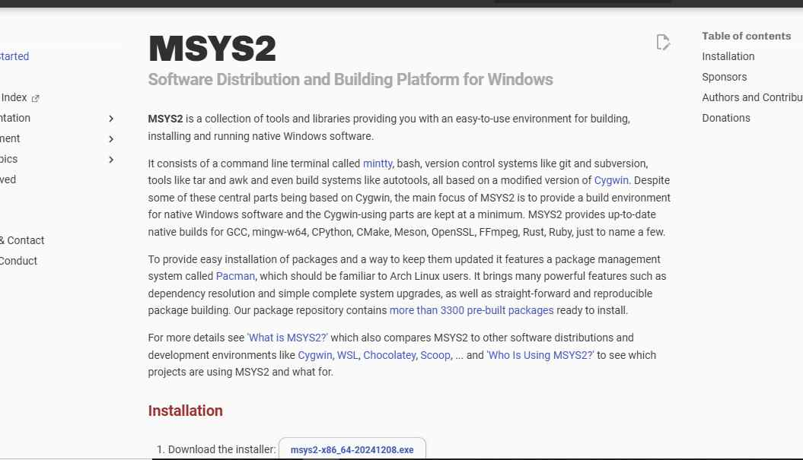

# Лабораторная работа №1. Виртуальный сервер

## Студентка: **Годорожа Оксана**, группа I2302

Дата выполнения: **10.02.2025**

## Описание задачи

В данной лабораторной работе необходимо изучить основы виртуализации операционных систем и развернуть виртуальный HTTP-сервер. В процессе выполнения будет установлена виртуальная машина с Debian с использованием QEMU, развернута LAMP-среда, установлен PhpMyAdmin и CMS Drupal, а также произведена настройка виртуальных хостов Apache. Заключительным этапом станет завершение установки сайтов.


### Подготовительные действия для начала выполнения лабораторной 

1. Устанавливаю MYSYS2.



1. Запускаю MYSYS2 и создаю директорию `lab01` командой `mkdir lab01`.

2. Внутри `lab01` создаю папку `dvd` и файл `readme.md` командой `cat > readme.md`.

3. Перехожу на официальный сайт Debian и копирую ссылку для загрузки ISO-образа `64-bit PC DVD-1`.


1. Вхожу в каталог `dvd` (`cd dvd`) и скачиваю ISO-образ:

   ```sh
   wget -O debian.iso https://cdimage.debian.org/debian-cd/current/amd64/iso-dvd/debian-12.9.0-amd64-DVD-1.iso
   ```

   Ключ `-O` используется для сохранения файла под именем `debian.iso`.

2. Устанавливаю QEMU с помощью команды, указанной в официальной документации:

   ```sh
   pacman -S mingw-w64-ucrt-x86_64-qemu
   ```

3. Проверяю, что QEMU установлен:


### Установка Debian в виртуальной машине

1. Создаю виртуальный диск для установки ОС (8 ГБ, формат qcow2):

   ```sh
   qemu-img create -f qcow2 debian.qcow2 8G
   ```

2. Запускаю установку Debian:

   ```sh
   qemu-system-x86_64 -hda debian.qcow2 -cdrom dvd/debian.iso -boot d -m 2G
   ```

   Первые несколько попыток завершились неудачно из-за бесконечной загрузки с диска.

   Успешная установка была выполнена через графический интерфейс.


1. Основные параметры установки:

   - Имя хоста: **debian.localhost**
   - Пользователь: **user**, пароль: **password**
   - Установлены только `standart system utilities` (без графической среды)


### Запуск виртуальной машины

1. Запускаю систему с виртуального жесткого диска, выделяю 2 ГБ RAM, 2 ядра процессора, настраиваю NAT-сеть и проброс портов:
   ```sh
   qemu-system-x86_64 -hda debian.qcow2 -m 2G -smp 2 \
       -device e1000,netdev=net0 -netdev user,id=net0,hostfwd=tcp::1080-:80,hostfwd=tcp::1022-:22
   ```

### Установка LAMP

1. Переключаюсь на суперпользователя:
   ```sh
   su
   ```
2. Обновляю список пакетов и устанавливаю необходимые компоненты:
   ```sh
   apt update -y
   apt install -y apache2 php libapache2-mod-php php-mysql mariadb-server mariadb-client unzip
   ```
   Возникла ошибка из-за отсутствия репозиториев в `/etc/apt/sources.list`. Добавляю строки:
   ```
   deb http://deb.debian.org/debian bookworm main contrib non-free non-free-firmware
   deb  http://security.debian.org/debian-security bookworm-security main contrib non-free non-free-firmware
   deb http://deb.debian.org/debian bookworm-updates main contrib non-free non-free-firmware
   ```

### Установка PhpMyAdmin и Drupal

1. Скачиваю пакеты:
   ```sh
   wget https://files.phpmyadmin.net/phpMyAdmin/5.2.2/phpMyAdmin-5.2.2-all-languages.zip
   wget https://ftp.drupal.org/files/projects/drupal-11.1.1.zip
   ```
2. Распаковываю и перемещаю файлы в `/var/www/`:
   ```sh
   unzip phpMyAdmin-5.2.2-all-languages.zip
   unzip drupal-11.1.1.zip
   mv phpMyAdmin-5.2.2-all-languages /var/www/phpmyadmin
   mv drupal-11.1.1 /var/www/drupal
   ```

### Настройка базы данных

1. Создаю базу данных для Drupal и пользователя:
   ```sh
   mysql -u root
   CREATE DATABASE drupal_db;
   CREATE USER 'daniil'@'localhost' IDENTIFIED BY 'password';
   GRANT ALL PRIVILEGES ON drupal_db.* TO 'daniil'@'localhost';
   FLUSH PRIVILEGES;
   EXIT;
   ```

### Настройка виртуальных хостов Apache

1. Добавляю конфигурации для PhpMyAdmin и Drupal в `/etc/apache2/sites-available/`.
2. Активирую сайты:
   ```sh
   /usr/sbin/a2ensite 01-phpmyadmin
   /usr/sbin/a2ensite 02-drupal
   ```
3. Добавляю записи в `/etc/hosts`:
   ```sh
   127.0.0.1 phpmyadmin.localhost
   127.0.0.1 drupal.localhost
   ```

### Запуск и тестирование

1. Перезапускаю Apache:
   ```sh
   systemctl restart apache2
   ```
2. Проверяю доступность сайтов:
   - `http://drupal.localhost:1080`
   - `http://phpmyadmin.localhost:1080`

## Вывод

В ходе лабораторной работы были изучены основы виртуализации, установка и настройка Debian, развертывание LAMP-сервера, установка PhpMyAdmin и Drupal, а также настройка виртуальных хостов Apache. Получен практический опыт в решении возникающих проблем и настройке серверных компонентов.

## Библиография

1. [Официальный сайт Debian](https://www.debian.org)
2. [Документация QEMU](https://www.qemu.org/documentation)
3. [Гайд по обновлению PHP](https://php.watch/articles/php-8.3-install-upgrade-on-debian-ubuntu)

